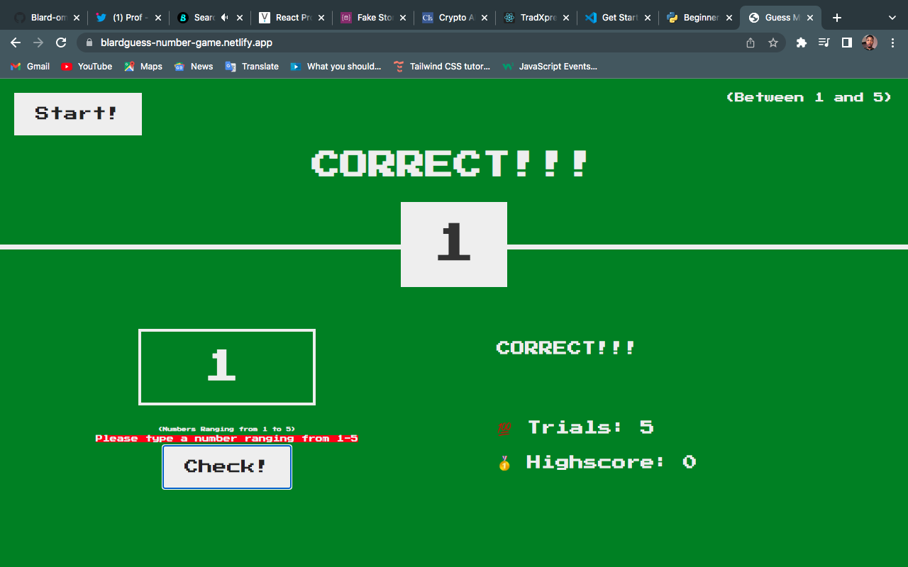
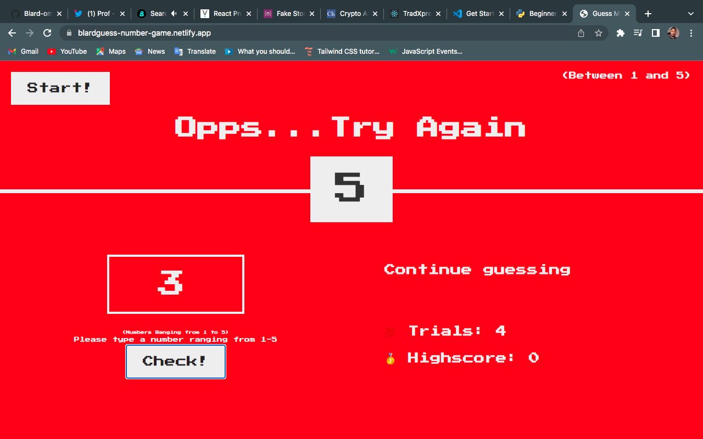

# Guess-Number_Game 

This is a simple game developed using vanilla js.
Key feature includes Start & check buttons, color change function.
You're only required to enter numbers between 1-5 and click "Check".

If the number entered matches the random number generated by the App, it displays "Correct",
else, it'll display "Opss you're wrong".

To restart the game click "Start" button.

 
Win mode
 
   
 Loss mode
 
